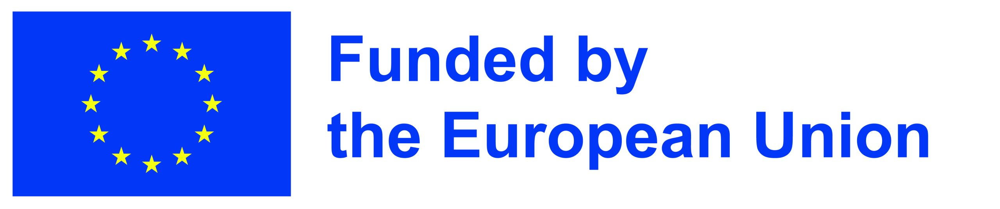

AQTIVATE - Advanced computing, QuanTum algorIthms and data-driVen
Approaches for science, Technology and Engineering

    

        
    

    

        This project has received funding from the European Union’s research and innovation programme under the Marie Skłodowska-Curie Doctoral Networks action and Grant Agreement No 101072344.
    

